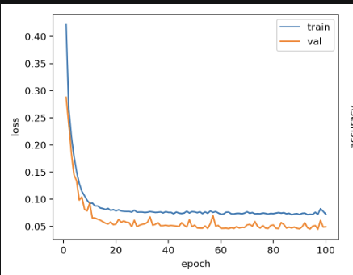
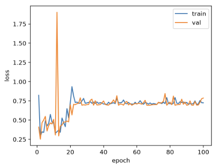
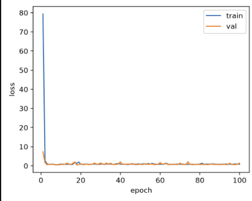
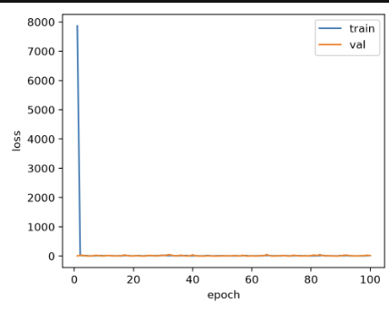
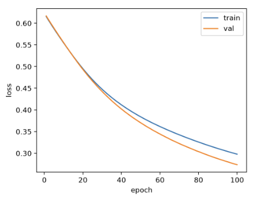
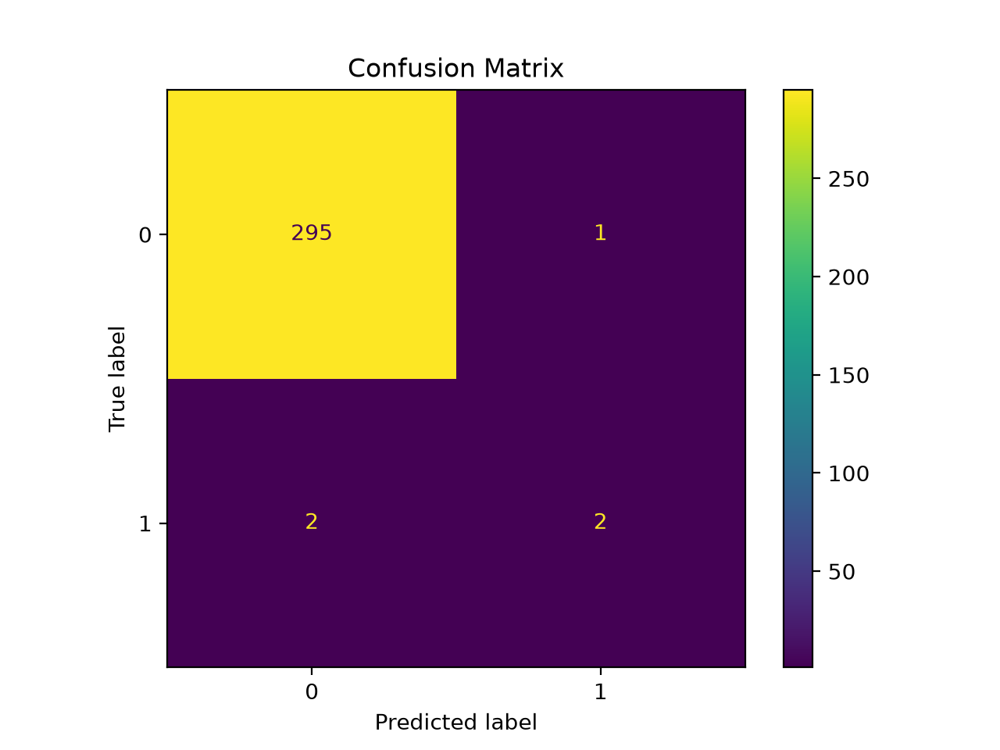
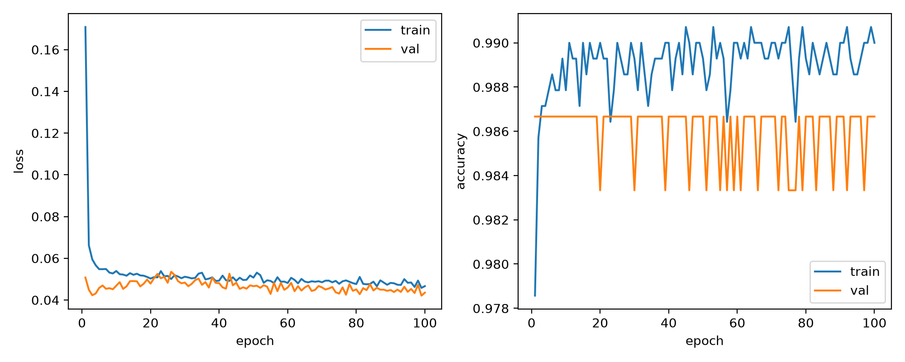
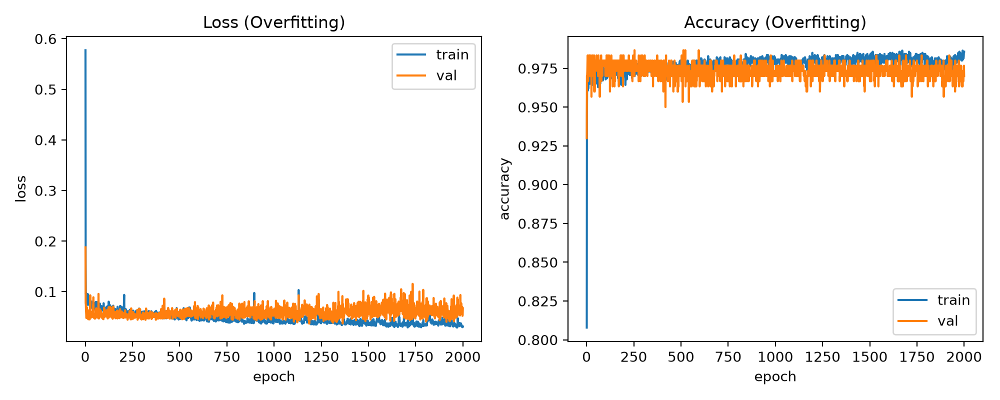

# 趁热打铁

### 1. 你在这个任务之中，选择了什么激活函数，为什么选这个？
选择的是 ReLU。

原因如下：
1. 计算简单，只需要判断正负性，速度快，符合 `make_moons`的简单二分类要求。
2. 缓解梯度消失：ReLU 在正区间的梯度恒为 1，不会衰减。所以深层网络更容易训练。
3. 直接把负数变成 0，减少了神经元激活的计算占用，同时使用的神经元的数量减少也降低了过拟合风险。

### 2. 你选择了什么损失函数？为什么？那如果这一题是三分类问题呢？
选择了 CrossEntropyLoss，原因如下：
1. 交叉熵配合 Softmax，梯度形式简洁，更新稳定。不像均方误差那样容易梯度消失。
2. CrossEntropyLoss 内部自动做 Softmax，所以模型输出层不需要再加 Softmax。
3. 普适性强，三分类、十分类都能用，只是输出维度变。

如果是三分类问题，也选 CrossEntropyLoss。
几种损失函数分别适合做什么？

### 3. `optimizer.zero_grad()`、`loss.backward()` 和 `optimizer.step()` 分别完成了什么工作？如果不清空梯度会发生什么？
- `optimizer.zero_grad()`：清除上一 epoch 积累的梯度。
- `loss.backward()`：反向传播，从 loss 出发，沿着计算图反向计算每个参数的梯度，并将其存到每个参数的 `.grad` 属性里。
- `optimizer.step()`：读取每个参数的 `.grad` 中的梯度，根据优化器的规则调整参数值。

如果不清除积累，参数更新读取的就是累计后的梯度，更新方向将受到过时数据影响导向错误，而随着梯度越来越大，就需要更大的步长，满足大梯度需要的大更新幅度，但学习率又是人工设置的超参数，更新速度难以跟上梯度累计速度。

### 4. 更深、更宽的神经网络一定能取得更好的效果吗？模型过于简单或过于复杂分别可能带来什么问题？
不一定。
- 更深的神经网路层数更多，可以学习更加复杂的特征（比如说非线性更复杂的数据），但层数多最终乘出来的梯度爆炸或者衰减的速度更快，需要训练的参数更多，同时可能出现已经前面层表示已经完善而后面层反而引入噪声等干扰，更难训练；
- 而更宽的神经元数更多，能够更新的参数更多，能拟合更复杂的函数（学习更复杂特征），但参数太多，更容易记住训练集中每个样本，包括那些受噪声影响的，也就是发生过拟合。

- 过于简单：欠拟合，损失高、准确率低。
- 过于复杂：训练/计算效率低，过拟合风险高。

### 5. 学习率过大或过小会怎样影响模型训练？你能从 loss 曲线中观察到哪些现象？

##### 学习率过大：
更新步长过大，出来的参数可能在最优解附近~~左右横跳~~来回振荡而始终落不到最优解上，或者直接跨到参数爆炸的地步，出现无法表示数值的 `Inf` 或 `NaN`。

- loss 曲线：剧烈振荡，不会稳定收敛，甚至可能趋势向上或者突然变成 NaN.

例如：

- LR = 0.01 时，非常正常的波动，总体 loss 趋势向下。


- LR = 1 时，图线崎岖不平，第 10 个 epoch 突然飙升到 1.9，20 轮之后卡在 0.7 左右，且 Train 和 Val 完全重合，总体损失反而呈上升趋势。本质上是学习率过大，优化器用力过猛，离最优解是越推越远。


- LR = 10 时，由于学习率过大，第一个 epoch 就遭遇剧烈参数更新，所以初始 Loss 奇高；后续的 loss 突然断崖式下跌，看似降为完美的 0，但其实是因为学习率太大，模型为了强行降低 Loss，把权重调得极大，硬生生扭曲了决策边界，把那些噪声点也强行圈进去，让每一个点都预测正确。这就是传说中的模型过度自信，发生暴力拟合，实际泛化能力其实很差。


- LR = 100，由于学习率过过过过大，一开始 epoch 的 Loss 就出现 NaN（超出计算机显示范围）, Loss 曲线突然笔直地向上冲，冲破图表的顶部，然后整条线消失。

看似平静的大事故现场 be like：


##### 学习率过小：
收敛很慢，每步只走一点点，曲线看起来几乎不动，需要很多轮才能到达最低点。可能卡在局部极小或鞍点，步长太小，没有足够能量跳出去。

例：
- LR = 0.0001，loss 呈类似平滑曲线，相比同样 epoch 数的模型，下降速度显著更加缓慢。


### 6. 假设还有一个分类问题，但是两个类别的样本数量非常不均衡，训练出来的模型会怎么样？为什么？说明了什么？ 你可以尝试构造一个数据集试试看。
- 问题：模型可能倾向于预测多数类，准确率往往很高。


- 原因可以通过举例快速理解：比方说，现在有 99% 的数据类别为 1，而 1% 的数据类别为 0。那么模型在预测一个数据的类别时，如果预测它为 1，则有 99% 的概率预测正确，预测它为 0 的成功概率却只有 1%。

现构造这样的数据集（如 mlp_imbalanced 文件夹中源代码所示）:
```python
X, y = make_classification(
    n_samples=N_SAMPLES,        # 总样本数
    n_features=2,          # 两个特征
    n_informative=2,       # 两个特征都有信息量
    n_redundant=0,         # 无冗余特征
    n_clusters_per_class=1,# 每个类别一个簇
    weights=[0.99, 0.01],  # 类别 0 占 99%，类别 1 占 1%
    random_state=42        # 随机种子
)
```

图线 be like：

- 猜对多数类的概率奇高（295/296），而猜对少数类的概率只有 50%.
- 但整体准确率仍然由于多数类准确率高而同样很高。


**准确率极高，但振荡剧烈，本质上是对于少数类数据也把它猜成多数类，所以时而错时而对。**

*一些些不成熟的直觉和补充的数学原理*

直觉上认为对于模型来说，多数类数据会因其多数而产生更大的贡献，也就是说，模型已有的偏置/权重等参数目前的效果，都与多数类数据的那个类别密切相关，所以在同样的成本条件下，优先照顾好这一部分数据的性价比显然更高。

拿前面最开始举的例子来说，因为类别为 1 的数据占据了 99%，所以对于 loss 的贡献也是 99%，那么模型会优先预测对类别为 1 的数据，至于类别为 0 的数据，即使全预测错，也只增加 1% 的损失。

>数学解释:
>对于一批样本，交叉熵损失是每个样本损失的平均值，每个样本对损失的贡献都是相同的，所以这时，不同类别的数据的数量就显得格外重要。
>同时，多数类的梯度总和远大于少数类，偏置差 b1 - b0 被推得极负，模型对所有样本都给出很低的类别 0 概率，少数类因此被误分类。
----

**这说明一味关注准确率这一个指标，并不能完全判断模型能力，应该结合混淆矩阵等指标综合判断模型到底有没有真正学习到位。**

### 7. 如果想要过拟合这个数据集，你会怎么做？为什么？试试看能不能实现吧！（在别的数据集也可以）训练过程和数据呈现和正常训练有何不同？你通过什么判断他过拟合？
过拟合方法：
1. 减少训练实际采用的数据
2. 增加隐藏层神经元数量
3. 增加 epoch 数
4. 不再保存最佳模型，直接取最后一个 epoch 的。

实践（见文件夹`mlp_overfit`）：
```python
N_SAMPLES = 2000
NOISE = 0.20
RANDOM_STATE = 30
BATCH_SIZE = 64
HIDDEN_UNITS = 512          # 原来 16，现在 512，容量大增
NUM_EPOCHS = 2000           # 原来 100，现在 2000，训练更久
LR = 0.01
SEED = 30

# 不再保存最佳模型，也不加载最佳模型
```
- 验证集损失在 epoch 250 左右降至最低点（大约 0.07），随后开始震荡并缓慢上升。
- 验证集准确率波动剧烈，随着 epoch 增加，验证准确率并没有随着训练准确率的提升而提升，反而略微呈现下降趋势。


原因：在参数多/训练久/且不及时早停的前提下，模型表达能力前所未有地强，能把训练集每个样本都记得清清楚楚，连受到噪声影响的也会死记硬背下来，那么接下来面对不熟悉的验证集/测试集表现就很差了。

判断标准：
    训练集损失小，且远小于验证集损失；
    训练集准确率大，且远大于验证集准确率。
- 查询补充：验证损失曲线呈 U 形，随 epoch 增加先降后升，拐点就是最佳停止点。