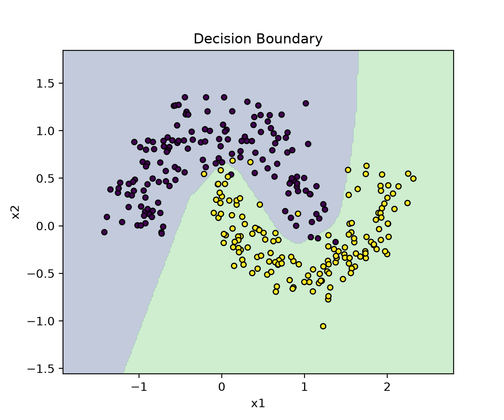
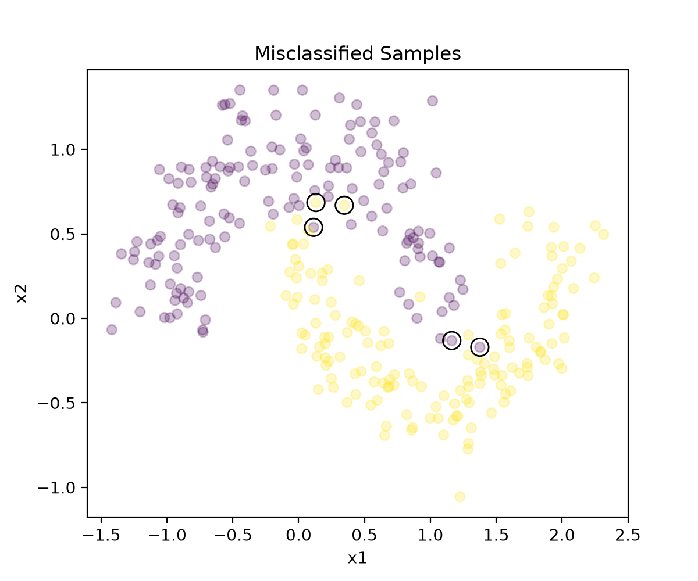

# TO DO LIST：分析模型判断错误的样本

### 1. 分析对象
前五个分析错误的样本

### 2. 分析方法
```python
wrong = np.where(test_labels != test_preds)[0][:5]
```
### 3. 具体分析内容如下：



可以观察到，*前五个分析错误的样本主要分布在决策边界附近，距离并不远。*

-所以猜想后续改进思路如下：
- 通过一定手段把决策边界变得更加清晰，也就是说，让模型**对于边界附近的这些模糊的样本点**能够更加清楚区分。

### 4. 分析错误样本の一丢丢感悟：

通过分析模型判断在哪里出错/怎样出错/错了多少，我们可以清晰地看到下一次设计模型/选取超参数等等人工操作中，我们到底怎么让机器更聪明、该往什么方向努力。

藏在机器内部数字计算里的错误，通过图线对比/数据列表等等方式，终于得以清晰地展现在人们眼前~~（莫名文艺的感慨（~~