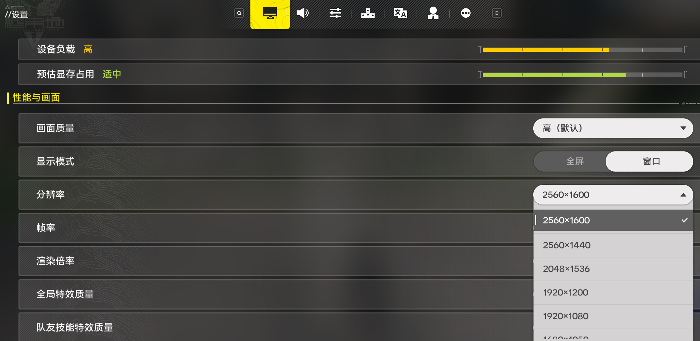
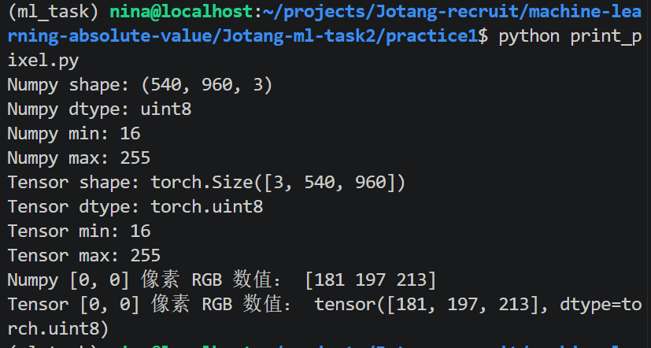
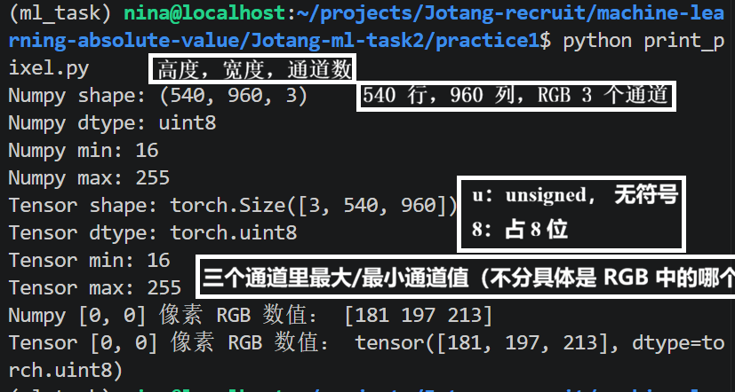
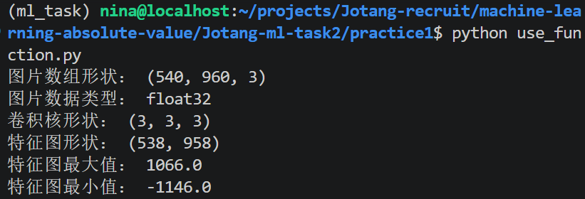
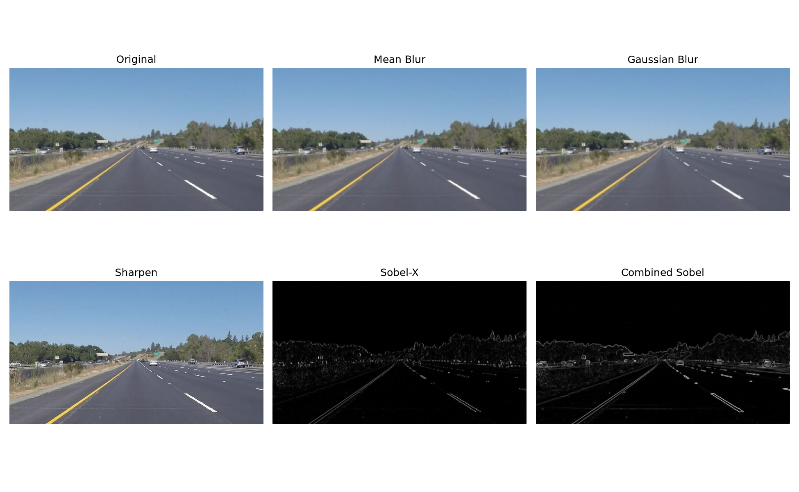
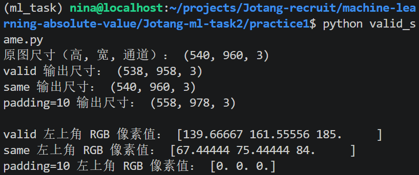

# TO DO LIST: Task 2 回答文档

## 写在前面

### 快速批改跳转站~😊
（GPT 老师倾情整理🙏~~好用的 AI 小秘~~）

- [实践 1：卷积核](#实践-1卷积核)
  - [1. 了解数字图片如何被表示](#1-了解数字图片如何被表示)
    - [1.1 像素是什么？](#11-像素是什么)
    - [1.2 什么是 RGB？](#12-什么是-rgb)
    - [1.3 灰度图和彩色图有什么区别？](#13-灰度图和彩色图有什么区别)
    - [关于像素的思考：不同领域中的“像素”](#关于像素的思考不同领域中的像素)
  - [2. 图像转化](#2-图像转化)
    - [2.1 将图片转换为 NumPy 数组和 PyTorch Tensor](#21-将图片转换为-numpy-数组和-pytorch-tensor)
    - [2.2 图像的维度、数值及 HWC 与 CHW 的区别](#22-图像的维度数值及-hwc-与-chw-的区别)
    - [关于 HWC 与 CHW 的疑问：为什么会有这种区别？](#关于-hwc-与-chw-的疑问为什么会有这种区别)
  - [3. 二维卷积](#3-二维卷积)
    - [3.1 卷积核是什么？](#31-卷积核是什么)
    - [3.2 卷积核在图片上怎样移动？](#32-卷积核在图片上怎样移动)
    - [巨大疑问：stride 无法完整覆盖图片时怎么办？](#巨大疑问stride-无法完整覆盖图片时怎么办)
    - [关于 padding 的补充：Zero Padding 与 Replication Padding](#关于-padding-的补充zero-padding-与-replication-padding)
    - [3.3 每到一个位置进行了什么计算？](#33-每到一个位置进行了什么计算)
    - [进一步学习：卷积核在每个位置的数学计算过程](#进一步学习卷积核在每个位置的数学计算过程)
  - [4. 手写函数](#4-手写函数)
    - [4.1 手写灰度图二维卷积函数](#41-手写灰度图二维卷积函数)
    - [4.2 手写 RGB 图二维卷积函数](#42-手写-rgb-图二维卷积函数)
    - [4.3 实操输出结果](#43-实操输出结果)
    - [4.4 学习日志与实践总结](#44-学习日志与实践总结)
  - [5. 图像处理](#5-图像处理)
    - [完成思路：四种卷积核的原理与实践](#完成思路四种卷积核的原理与实践)
  - [6. 观察并解释每种处理带来的变化](#6-观察并解释每种处理带来的变化)
    - [6.1 为什么均值与高斯卷积会让图片变模糊？](#61-为什么均值与高斯卷积会让图片变模糊)
    - [6.2 为什么锐化会让边缘更明显？](#62-为什么锐化会让边缘更明显)
    - [6.3 Sobel 卷积核为什么能找到边缘？](#63-sobel-卷积核为什么能找到边缘)
    - [原理分析与代码留档](#原理分析与代码留档)
  - [7. valid vs same](#7-valid-vs-same)
    - [7.1 比较 valid 与 same 的输出尺寸和边缘变化](#71-比较-valid-与-same-的输出尺寸和边缘变化)
    - [7.2 记录卷积核大小、padding、stride 与输出尺寸的关系](#72-记录卷积核大小paddingstride-与输出尺寸的关系)
  - [8. 关于保存图片时如何处理超出像素范围的值](#8-关于保存图片时如何处理超出像素范围的值)
    - [我的思考：超出像素范围的值应该如何处理？](#我的思考超出像素范围的值应该如何处理)
    - [方法一：裁剪到合法范围](#方法一裁剪到合法范围)
    - [方法二：直接转换数据类型](#方法二直接转换数据类型)
    - [方法三：归一化到 0～255](#方法三归一化到-0～255)
    - [方法四：使用 Pillow 保存图片](#方法四使用-pillow-保存图片)
    - [方法对比](#方法对比)

### Task 2 学习日志
>本日志主要记录每个任务的完成时间 + 说明特色内容（含有什么拓展知识/代码附件/实操尝试/结果截图等等），同样贴在了 `README.md`里便于查看:D

⚠**需要注意的是：此处未说明具体文件名称的知识拓展/思考过程等等均收录在本回答文档的相应位置。**


| 日期 | 完成内容 | 备注 |
| ---- | ----- | ----- |
| 10.8 | 实践 1：Q1 像素、RGB、灰度图与彩色图 | 知识拓展：像素概念在图像数据与显示器硬件层面的区别。<br>图片：`screenshots/endfield_pixel.png`（游戏设置中的屏幕像素设置）。 |
| 10.8 | 实践 1：Q2 图像转化 | 代码：`practice1/print_pixel.py`（图像读取的源代码）。<br>截图：`screenshots/print_pixel.png`（shape、dtype、最大值、最小值及像素 RGB 数值输出）。<br>截图：`screenshots/explanation_pixel.png`（维度与像素数值说明）。<br>**疑惑与思考**：**关于 HWC/CHW 排列差异来源**，回答文档中仅贴问题，具体解答详见`note-comprehensive.md`。 |
| 10.8 | 实践 1：Q3 二维卷积 | **疑惑与思考**：关于 `stride设置`&`完整卷积核放不下怎么办？`。<br>GPT 图示：卷积核逐位置计算过程的图示解析，详见`note-comprehensive.md`（stride、padding、输出尺寸计算、Zero Padding 与 Replication Padding）。 |
| 10.8 | 实践 1：Q4 手写函数 | 代码：`convolution_function.py`（灰度图二维互相关函数 `corr2d()`）。<br>代码：`practice1/use_function.py`（RGB 图像处理函数 `conv2d_rgb()`）。<br>截图：`screenshots/function_result.png`（手写函数的实操结果）。<br>**学习日志**：关于`数学建模`的一点点感悟 |
| 10.9 | 实践 1：Q5 图像处理 | **思考过程记录：完成思路说明**<br>代码：`compare_4kernels.py`（均值模糊、高斯模糊、锐化、Sobel 边缘检测）。<br>输出结果：`compare_result.png`（原图与四种卷积核处理结果的对比图。）<br>笔记留档：`note-comprehensive`（四种卷积核的原理分析及代码分块解析。） |
| 10.10 | 实践 1：Q6-Q7 | **代码：**`valid_same.py`，完成 Q7 尝试不填充（valid）和适当填充（same）图片边缘（此处自己补充了一个极端的 padding = 10）<br>**输出结果**：`valid_same_result.png`<br>**补充思考**：保存图片时如何处理超出像素范围的值 |

**其他**

1. 本文引用块内包含部分`思考过程`+`拓展知识`
2. 三级标题标注回答的题号。
3. 删除线删去了一些些心里戏~~（觉得有点不正经出戏可跳过捏，学妹是吐槽役来的:D）~~
4. （10.10更新）添加了回答文档开头的标题跳转。

## 实践 1：卷积核

### 1. 了解数字图片如何被表示。
回答：像素是什么？什么是 RGB？灰度图和彩色图有什么区别？

1. **像素是什么？**

像素是数字图片的最小单位：

>在这里，我查到“像素包含 RGB 等信息”。
>但是经验认为，日常中的像素是一种类似于图片中最小单位的马赛克，不太可能把 RGB 等数值直接写在，我们放大图片后看到的像素格子里。
>于是猜测，不同层级/不同领域的“像素”这个名词的指代应当不一样。

- 在位图编辑器（PS等等）中，像素是图像数据的最小格子
- 在计算机视觉领域，像素是代表图像的数组里的一个元素。
- 操作系统和显示器：是硬件层面最小的可控发光单元，游戏里说的屏幕参数，比如`1920×1080`等：



2. **什么是 RGB？**

RGB 指的是 red/green/blue，红绿蓝三种原色光调整不同等级（对应 0 ~ 255）融合得到不同复杂颜色。

>我们生活中用的色号其实也是这种表示形式

3. **灰度图和彩色图有什么区别？**

| ------- | 灰度图 | 彩色图 |
| 储存信息 | 只储存关于亮度的一个值 | 储存 RGB 三个值，同时表示颜色和亮暗 |
| shape | `(H, W)` | `(H, W, 3)` |

---
### 2. 图像转化
- 使用上面这张图片，用 Pillow 或其他图像读取工具将它转换为 NumPy 数组和 PyTorch Tensor。
- 打印他的 shape、dtype、最大值和最小值，再打印一个像素的 RGB 数值。
- 说明每个维度和数值分别表示什么，以及 NumPy/Pillow 常见的 HWC 与 PyTorch 常见的 CHW 排列有什么区别。

1. **用 Pillow 或其他图像读取工具将`outer1.png`转换为 NumPy 数组和 PyTorch Tensor。打印它的 shape、dtype、最大值和最小值，再打印一个像素的 RGB 数值。**

代码如下：
```python
from PIL import Image
import numpy as np
import torch

outer1 = Image.open("./../images/outer1.png").convert("RGB")
# 使用 Pillow 读取图片，转成 RGB 模式

arr = np.array(outer1)
tensor = torch.from_numpy(arr).permute(2, 0, 1)
# 转为 NumPy 数组和 PyTorch Tensor, 并且将 HWC 转为 PyTorch 常用的 CHW

print("Numpy shape:", arr.shape)
print("Numpy dtype:", arr.dtype)
print("Numpy min:", arr.min())
print("Numpy max:", arr.max())
# 打印 Numpy 的 shape、dtype、最大值和最小值

print("Tensor shape:", tensor.shape)
print("Tensor dtype:", tensor.dtype)
print("Tensor min:", tensor.min().item())
print("Tensor max:", tensor.max().item())
# 打印 Tensor 的 shape、dtype、最大值和最小值

y, x = 0, 0
print("Numpy [0, 0] 像素 RGB 数值：", arr[y, x])
print("Tensor [0, 0] 像素 RGB 数值：", tensor[:, y, x])
# 打印 [0, 0] 这个像素的 RGB 值
```

2. **说明每个维度和数值分别表示什么，以及 NumPy/Pillow 常见的 HWC 与 PyTorch 常见的 CHW 排列有什么区别。**

程序输出结果如下：


**说明个维度和数值分别表示什么：**

~~（排版一塌糊涂，再也不会尝试在截图里写笔记了`:(`）~~
- H = 图像有多少行；W = 图像有多少列；C = 通道数（channel）
- 最小值 16：图片中出现的最小的通道强度值是 16；最大值 255：图片中出现的最大的通道强度值是 255。（不区分 RGB）
- 关于`uint8`：`u`：unsigned，无符号，没有负数；`int`：整数；`8`：占 8 位，即 1 个字节。
- [0, 0]（[y, x]）：y = 0 表示第一行，x = 0 第一列。
- `[R, G, B] = [181, 197, 213]`:表示三个通道的各自的强度值，没有制约关系哦。

**NumPy/Pillow 常见的 HWC 与 PyTorch 常见的 CHW 排列有什么区别。**

>表面上看只是维度顺序不同，但应当还有更深层的原因，于是追问：**为什么会产生这种区别？就是设计不同？还是需求变化？为什么我们需要这种区别？**（追问答案详见`note-comprehensive.md`）

维度顺序不同。HWC 通常默认是连续数组，同一像素的多个通道值通常相邻存放。而 CHW 的不同通道一般分开存放，类似于`R|G|B`。~~（当然，据说都有例外，但此处先不讨论复杂情况，先做基础了解:/）~~

---
### 3. 二维卷积
了解二维卷积的基本过程。用自己的话解释：

- 3-1 **卷积核是什么？**

卷积核本质上是一个小矩阵，形状小于图片，用来从图片中寻找某种局部特征，作用类似于观察图像的一个小镜头。

- 3-2 **它在图片上怎样移动？**

按照 stride，从左到右，再从上到下移动。stride 就是每次移动的步数。比如 stride = 1 时，卷积核就从左上角，一个像素一个像素向右，然后一行结束了以后就向下移动一个像素，重复刚才操作。

>*巨大的疑问*：那如果 stride 设置得不够每次移动完美覆盖一行/剩下的区域不够放下一个完整卷积核怎么办？跳过么？还是固定了只能 stride = 1？

>（GPT辅助数学解释）答案是：通常直接不计算那个位置。这也是为什么输出的特征图尺寸会随着 stride 大小发生变化。但如果使用了 padding，情况又会不同。

>先讨论没有 padding 的情况：
比如说：
```
输入 = 5
卷积核 = 3
stride = 2
padding = 0
```
就有：
```
5×5
 ↓
3×3 卷积核
 ↓
stride=2
 ↓
2×2 输出
```
>接下来讨论有 padding 的情况：
>通常使用公式：
```
输出大小
=
⌊(输入大小 + 2×padding - 卷积核大小) / stride⌋
+ 1
```

>padding 填充，其实就是在图片边缘人为补几圈像素（一圈是指四角也填上，无缺口）。
比如说：
```
padding = 1 后：
0 0 0 0 0
0 1 2 3 0
0 4 5 6 0
0 7 8 9 0
0 0 0 0 0
```

>继续补充：不只有 zero padding，还有 Replication Padding
```
1 1 2 3 3
1 1 2 3 3
4 4 5 6 6
7 7 8 9 9
7 7 8 9 9
```

- 3-3 **每到一个位置进行了什么计算？**

卷积核与它覆盖的区域的**对应位置的数字相乘并加和**（类似于分块矩阵，但这里的分块是连续可相交的），得到的输出值大致可以衡量*当前的局部区域与当前卷积核代表的模式的匹配度*。最终得到的所有输出值，按照原来的相对位置排列成新矩阵，这就叫做特征图。

>`note-comprehensive.md`可见**请 GPT 老师画图展示卷积核对于每个位置数学计算的过程**
----
### 4. 手写函数
仅使用 Python 和 NumPy，手写一个能够处理灰度图或 RGB 图片的二维卷积函数。核心卷积过程不能调用 `cv2.filter2D`、`scipy.signal.convolve2d`、`torch.nn.Conv2d` 等现成实现。

- **4-1 手写函数**：

`convolution_function.py`：能处理灰度图的二维卷积函数`corr2d()`
>（主要参考《动手学机器学习》Pytorch 版第 223 页）

```python
import numpy as np

def corr2d(X, K):
# 输入图片 X 和卷积核 K
    kh, kw = K.shape
    # 得到卷积核的高度和宽度

    out_h = X.shape[0] - kh + 1
    out_w = X.shape[1] - kw + 1
    # 输出卷积核在图片中的实际滑动范围

    Y = np.zeros((out_h, out_w))
    # 创建一个形状为 (out_h, out_w) 的零矩阵

    for i in range(out_h):
        for j in range(out_w):
        # 实现先从左向右，再上到下滑动
            region = X[i:i + kh, j:j + kw]
            # 滑动（此处为 stride = 1）取 X 中卷积核要覆盖的局部区域：从第 i 行到第 (i + kh - 1 ) 行共 kh 行，列数同理
            Y[i, j] = np.sum(region * K)
            # 此处是取出的矩阵和卷积核对应位置相乘再相加，得到输出值加到 Y 对应位置上去

    return Y
    # 最终得到 X 关于 K 的特征图 Y
```

- **4-2 手写函数 2.0**：
`use_function.py`：内含能处理 RGB 图的二维卷积函数`conv2d_rgb()`
>（在定义`corr2d()`的基础上，加上拆分 RGB 通道，处理`outer1.png`）

详见`practice1/use_function.py`，这里只写关键的不同：

```python
    for c in range(X.shape[2]):
        Y += corr2d(X[:, :, c], K[c])
        # 此处三个通道加和到一张特征图里
```
- **4-3 实操输出结果**


- **4-4 学习日志：**

- 手写二维卷积函数的过程听着很吓人，但实际就是通过合理的代码完成数学运算。
- ~~给自己灌一点心灵鸡汤~~总结：事实上计算机本质完成的就是数学计算。那么面对复杂的现实问题时，我们应当采取一种类似于`数学建模`的思想，*把文字表述变为数学架构*，同时也要注意把复杂拆为简单，*不要畏难，慢慢实现。*

----
### 5. 图像处理
至少使用下面四种卷积核处理同一张图片，把原图和结果放在一起比较：
   - 均值模糊：使用 3×3 的均值卷积核；
   - 高斯模糊：使用 5×5 的高斯卷积核，可以查阅高斯函数并自行生成或填写卷积核；
   - 锐化：例如使用 [[0,-1,0],[-1,5,-1],[0,-1,0]]；
   - 边缘检测：使用 Sobel-X 和 Sobel-Y，尝试把两个方向的结果合成为一张边缘图。

**关于完成思路**:

- 5-1 分析四种卷积核特点；
- 5-2 学习内部数学处理与外部图像变化的关系；
- 5-3 代码实现，分析处理流程。

[x]知识留档：四种卷积核的原理分析及代码分块解析，详见`note-comprehensive`。
[x]代码 + 输出结果详见`compare_4kernels.py`和`compare_result.png`
----
### 6. 观察并解释每种处理带来的变化：
- 为什么均值与高斯卷积会让图片变模糊？
- 为什么锐化会让边缘更明显？
- Sobel 卷积核为什么能找到边缘？

**输出结果**



**6-1 为什么均值与高斯卷积会让图片变模糊？**
- 均值卷积本质上是通过卷积核内所有元素相同，让图片最终的输出值取平均，表现在图片上就是原本亮的地方变暗，暗的地方变亮，造成图像中的边界线变得模糊，整体给人以更模糊的感受。
- 而高斯卷积也是同理，不过区别在于，高斯卷积是加权平均，卷积核中心的像素权重高，远处的权重低，也就是*更集中地反映卷积核所在位置的颜色信息*，而不是让所有位置都同样重要，这样能让颜色突变处的模糊效果更平滑。

**6-2 为什么锐化会让边缘更明显？**

锐化通过设置`中心为正、四周为负`型的卷积核，大大*增强像素之间的亮度差异*，实现让明暗差异更加突出的效果，整体给人以锐化的视觉效果。

如本题中采用的卷积核：
```python
sharpen_kernel = np.array([
    [0, -1, 0],
    [-1, 5, -1],
    [0, -1, 0]
], dtype=np.float32)
```

**6-3 Sobel 卷积核为什么能找到边缘？**

Sobel 卷积核，通过计算图像在某个方向上的亮度变化，实现把`边缘`这类通常是亮度变化比较剧烈的位置测出来。

例如本题中我使用的 Sobel：
```python
sobel_x = np.array([
    [-1, 0, 1],
    [-2, 0, 2],
    [-1, 0, 1]
], dtype=np.float32)

sobel_y = np.array([
    [-1, -2, -1],
    [0, 0, 0],
    [1, 2, 1]
], dtype=np.float32)
```
实际上就对应了：Sobel_x 卷积核在处理 x 轴方向时，左边负权重，右边正权重。如果存在这个方向上的亮度突变，那么这样的权重分配一般会让输出值的绝对值更大，从而判断是否存在 x 轴方向上的边界。sobel_y 同理。

### 7. valid vs same
分别尝试不填充（valid）和适当填充（same）图片边缘，比较输出尺寸与边缘像素的变化。记录卷积核大小、padding、stride 与输出尺寸之间的关系。

- **7-1 分别尝试不填充（valid）和适当填充（same）图片边缘，比较输出尺寸与边缘像素的变化。**

这里尝试了 valid 的 padding = 0、same 的 padding = 1 和极端一点的 padding = 10

输出结果如下：


观察可得:
- valid： 不填充，只计算卷积核能够完整覆盖输入图像的位置，因此**输出尺寸缩小**。
- same： 填充一圈 0，**输出尺寸与原图相同**，但边缘计算会受到填充值影响，当然这里只是一圈，**边缘亮度影响不明显**。
- padding=10： 填充十圈 0，**输出尺寸显著增大**，输出图像包含由填充区域产生的像素。同时**均值卷积核的影响让这里的边缘明显变暗，甚至变黑**。

这里贴[一个直观的博客](https://blog.csdn.net/yql_617540298/article/details/105127745)

- **7-2 记录卷积核大小、padding、stride 与输出尺寸之间的关系。**

\[
\boxed{
\text{输出尺寸}=
\left\lfloor
\frac{\text{输入尺寸}+2×padding-卷积核大小}{stride}
\right\rfloor+1
}
\]

### 8. 关于保存图片时如何处理超出像素范围的值

我的思考：

直观感受上，直接删除肯定不现实，为了保证图片的完整性，必须保存下来。当然这里也猜测，各种处理应当都会在一定程度上损失图像细节或者与原图不符。

查资料得到几种常见处理方式如下（使用 GPT 总结）：

1. 裁剪到合法范围（推荐）
```python
result = np.clip(result, 0, 255).astype(np.uint8)
```

- `np.clip(result, 0, 255)`：将小于 `0` 的值设为 `0`，大于 `255` 的值设为 `255`。
- `astype(np.uint8)`：将像素值转换为 8 位无符号整数，取值范围为 `0~255`。

**适用场景：** 卷积、锐化等运算后，像素值可能超出合法范围时。

2. 直接转换数据类型

```python
result = result.astype(np.uint8)
```

直接转换数据类型不会自动将数值限制在 `0~255`。超出范围的值可能发生回绕，导致图像显示异常。

**注意：** 当像素值可能超出范围时，不推荐直接转换。

3. 归一化到 `0~255`

```python
result = result.astype(np.float32)
result = result - result.min()
result = result / result.max() * 255
result = result.astype(np.uint8)
```

- 减去最小值：将最小值移动到 `0`。
- 除以最大值再乘以 `255`：将数值缩放到 `0~255`。
- 转换为 `uint8`：满足常见 8 位图像的像素存储要求。

**适用场景：** 将结果映射到可显示的范围，增强图像的显示对比度。

**注意：** 如果减去最小值后，所有像素值都为 `0`，就会发生除零错误，需要额外判断。

4. 使用 Pillow 保存图片

```python
from PIL import Image

result = np.clip(result, 0, 255).astype(np.uint8)
Image.fromarray(result).save("result.png")
```

- `Image.fromarray(result)`：将 NumPy 数组转换为 Pillow 图像对象。
- `.save("result.png")`：将图像保存为 PNG 文件。

保存前应确保数组的形状和数据类型符合图像格式要求。

5. 方法对比（手写）

| 方法 | 主要作用 | 注意事项 |
| --- | --- | --- |
| `np.clip()` | 限制超出范围的数据（区别于归一化，不是全部缩放!） | 不改变数据类型 |
| `astype(np.uint8)` | 转换数据类型 | 不会自动裁剪数值 |
| 归一化 | 将数值缩放到 `0~255` | 会改变原始数值之间的关系 |
| `Image.save()` | 保存图像文件 | 应确保数组格式正确 |