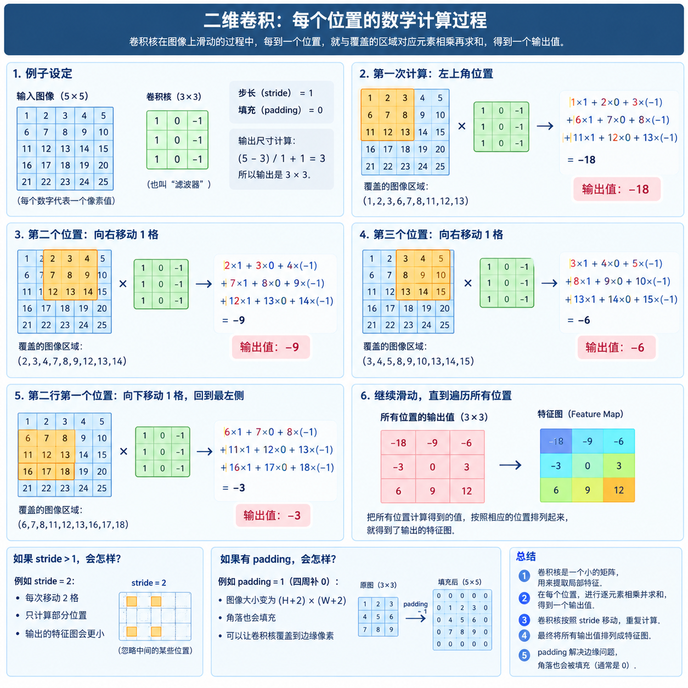

# TO DO LIST: 猫狗分类全流程学习笔记

## #0 关于数字图片
1. **为什么 RGB 是红绿蓝而不是红黄蓝？** 

因为屏幕是**发光**的，三原色相加是「加色法」；
而颜料是**反光**的，混色是「减色法」，所以打印机用青品黄（CMY）。这是物理原因，不是随便定的。

彩色图的形状是 `(高 H, 宽 W, 通道 C)`，比如 `(375, 500, 3)`。

RBG 三种子像素在屏幕上的常见排列：
- RGB 竖条纹：红、绿、蓝三个细长条并排，合起来近似一个方形像素。
------
- **对于一个未知`dpi`的图片，是否可以随便写一个索引指代某一像素？是否存在某种指代像素的索引范围/个数的概念？直觉上认为应当有一定的数量要求。**

经查，的确，对于图片来说，像素个数是有限的，索引也存在合法范围限制。使用`arr.shape`等得到 shape，可以得知索引的范围。比方说，对于(H, W, C)，也就是 H × W 个像素点，有索引取 0 到 H-1 之间的整数值。

- 补充个奇妙的小发现：*居然可以写 负数 [0, -1]*：

事实上，真实的图片中，并不存在所谓第 -1 列，实际上这是 python 中特有的负索引表示方式，此处的 -1 表示倒数第一。实际上，超出了(H, W, C)的合法范围，对于负索引是指不能超过 -H 或者 -W。

>知识小 tip：`:`表示这一维全部取
-----
- **用 PyTorch Tensor 和用 Numpy 数组有什么区别？**

1. 维度顺序不同：NumPy arr 是 HWC，PyTorch tensor 是 CHW。
2. （拓）深层原因：
NumPy 把通道放最后，方便“先定位像素，再看颜色”；PyTorch 把通道放最前，方便卷积网络在 H、W 上滑动、对 C 做加权。
| 对比 | NumPy 数组 | PyTorch Tensor |
|---|---|---|
| 常见图像形状 | HWC：`(540, 960, 3)` | CHW：`(3, 540, 960)` |
| 主要用途 | 通用数值计算、图像处理 | 深度学习、神经网络 |
| 硬件 | CPU | CPU 或 GPU |
| 自动求导 | 不支持 | 支持 |
| 取像素 | `arr[y, x]` | `tensor[:, y, x]` |
| 取红色通道 | `arr[:, :, 0]` | `tensor[0]` |
| 取一整行 y=0 | `arr[0]` | `tensor[:, 0, :]` |
| 取左上角 | `arr[0, 0]` | `tensor[:, 0, 0]` |
| 取右下角 | `arr[-1, -1]` | `tensor[:, -1, -1]` |

- **为什么会产生这种区别？就是设计不同？还是需求变化？**

这不是“需求变化”，而是**不同工具的设计选择和历史习惯**。

**NumPy / Pillow / Matplotlib / OpenCV：HWC**

- 面向通用图像处理；
- 图像直观上就是“二维网格，每格多个颜色值”；
- 先定位像素，再看 R、G、B，符合人的直觉。

**PyTorch / 深度学习框架：CHW**

- 面向卷积神经网络；
- 卷积层权重形状通常是 `(out_channels, in_channels, kernel_h, kernel_w)`；
- 输入特征图形状是 `(N, C, H, W)`；
- 把 C 放在前面，按通道分组、批归一化、通道注意力等操作更自然；
- 内存布局上，每个通道是一块连续区域，方便底层优化。

- **为什么我们需要这种区别？**
如果只有一种格式，就会有一方不自然：

- 图像处理更关心“某个像素的 R、G、B 是多少”，HWC 直观；
- 深度学习更关心“某一层通道上的特征图是什么”，CHW 直观；
- 卷积运算需要在 H、W 上滑动、在 C 上加权，CHW 让公式更简洁；
- 批处理时 `(N, C, H, W)` 四个维度语义清晰。

所以生态里形成了约定：

```text
Pillow / NumPy / OpenCV / Matplotlib：HWC
PyTorch / 深度学习框架：CHW
```

两者可以互相转换：

```python
# HWC -> CHW
tensor = t_hwc.permute(2, 0, 1)

# CHW -> HWC
arr = tensor.permute(1, 2, 0).numpy()
```

2. 通道 `channel`
通道是同一个像素的多个数值维度。

比方说，彩色图有 RBG 三个通道，每个通道可以被看做是一张完整的灰度图，在每个位置上都有 0~255 表示不同强度，最终的复杂颜色是由三个通道叠加而来。

3. shape

| 记法 | 形状  | 使用主体 |
| -------- | -------------- | --------------- |
| **HWC**  | (高, 宽, 通道)  | Pillow、OpenCV、matplotlib、NumPy 的惯例 |
| **CHW**  | (通道, 高, 宽)  | **PyTorch** 的惯例 |
| **NCHW** | (张数, 通道, 高, 宽) | 卷积层的实际输入（N = batch size） |

`.permute(2, 0, 1)`
`permute`重新排列张量的维度顺序。参数 (2, 0, 1)：表示新维度的排列方式。原来的第 2 维是通道 C，第 0 维是高度 H，第 1 维是宽度 W。 

H = 图像有多少行；W = 图像有多少列；C = 通道数

## #1 关于二维卷积

>基本描述（用于大致感受）：
>拿一个比较小的矩阵——卷积核，在这张大矩阵上不断移动；每到一个位置，就让卷积核中的数字和它覆盖的图片区域中的数字逐个相乘，再全部加起来，得到一个输出数字。

1. 基础概念

卷积核本质上是一个比较小的数字矩阵，用来从图片中寻找某种局部特征。

*为什么需要它”？为什么不直接对整张图片做处理*

**直觉上的一点点预备思考：**

事实上，人类识别图像的过程本质上就是识别细节的过程。当我们在图片中寻找猫时，我们实际上是通过寻找毛茸茸的、眼睛圆圆的、有尾巴的，总之就是一系列与猫相关的特征，识别出来这是猫的。

那么，在算力有限的情况下，拿着一个小镜头，取附近几个像素，就有可能在参数训练消耗小的情况下，完成任务。

又有思考：
**这样是否会破坏现实中合理的空间关系？比方说把猫的图片划分为 8 块重新打乱，那么机器如果只识别元素，仍然能识别出来就不符合我们的实际期望了。**

如果只是单纯地划分区域处理，就像最近学的分块矩阵一样，那么或许的确有可能只识别断电式的元素，但卷积核并不是纯划分，而是采取连续滑动的方式，应当可以识别出符合身体结构的整体。

**请 GPT 老师画图展示卷积核对于每个位置数学计算的过程**



---
2. 手写二维卷积函数


>关于卷积神经网络的一些性质：（来源于《动手学机器学习》）
1. 平移不变性（translationinvariance）：不管检测对象出现在图像中的哪个位置，神经网络的前面几层
应该对相同的图像区域具有相似的反应，即为“平移不变性”。
2. 局部性（locality）：神经网络的前面几层应该只探索输入图像中的局部区域，而不过度在意图像中相隔
较远区域的关系，这就是“局部性”原则。最终，可以聚合这些局部特征，以在整个图像级别进行预测。