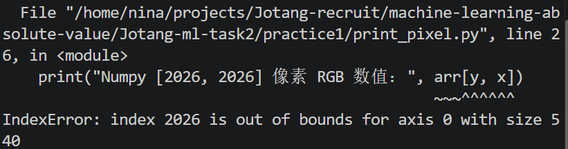

# Task 2 问题解决日志
## 写在前面：
为了更好地记录学习过程，进一步避免吃一堑吃一堑的重蹈覆辙，现重磅推出问题解决日志~（撒花撒花

本文主要包含：

1. **完成 Task 2 中遇见的问题 & 自己刻意制造的用于学习的"问题"（用`*`标注）**（截图 + 文字说明）

目前的主要分类有：
- 关于程序的代码问题；
- 环境配置；
- shell 命令；
- 其他待补充^^

2. **对应的解决方案以及一点点总结和感悟:D**

## 一、 关于程序

### Practice 1: 

*1. `print_pixel.py`：索引超出像素 shape

这里打印随机一个像素的坐标时，我想：对于一张图片来说，不可能存在无限多的像素点，不然的话，生活中的不同像素怎么解释呢？*像素点的索引应当是有范围的才对。*

于是随机选了一个相对较大的值`2026`，试图打印，看看会发生什么。

果然不能是任意的，索引大小值必须在 shape 范围内。

这里补充知识：对于图片来说，像素个数是有限的，索引也存在合法范围限制。使用`arr.shape`等得到 shape，可以得知索引的范围。比方说，对于(H, W, C)，也就是 H × W 个像素点，有索引取 0 到 H-1 之间的整数值。
---
然后又尝试使用负数：

于是得到奇妙的小发现：*居然可以写 负数 [0, -1]*：

事实上，真实的图片中，并不存在所谓第 -1 列，实际上这是 python 中特有的负索引表示方式，**此处的 -1 表示倒数第一**。也就是说，超出了(H, W, C)的合法范围，对于负索引其实是指不能超过 -H 或者 -W。

